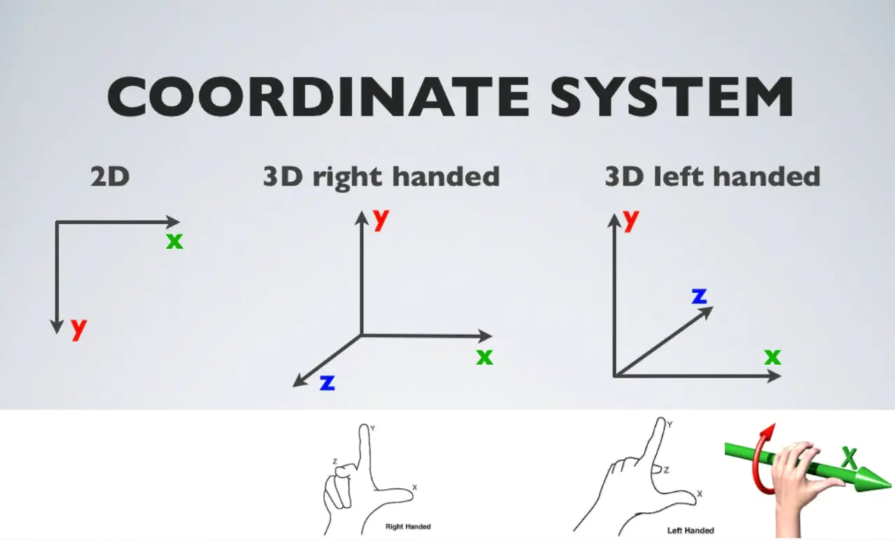
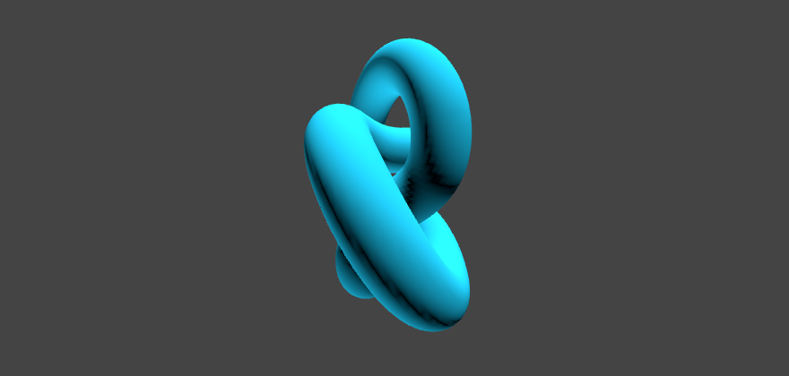

## 一、背景

1. OpenGL 是用于渲染 2D、3D 图形的跨语言、跨平台的应用程序编程接口（API）。这个接口由近 350 个不同的函数调用组成。
2. OpenGL ES 是 OpenGL 三维图形API的子集，针对手机、PDA和游戏主机等嵌入式设备而设计。基于OpenGL，一般使用 C 或 Cpp 开发，对前端开发者来说不是很友好。
3. WebGL 把 JavaScript 和 OpenGL ES 2.0 结合在一起，从而为前端开发者提供了使用 JavaScript 编写 3D 效果的能力。
## 二、THREE.JS基础
Three.js是基于原生 WebGL 封装运行的三维引擎，在所有 WebGL 引擎中，Three.js 是国内资料最多、使用最广泛的。
### 1、坐标系
```
右手坐标系
```

### 2、场景
```
是一个容器，主要用于保存、跟踪所要渲染的物体和使用的光源。
```
### 3、摄像机
```
决定了能够在场景中看到什么。
```

- 右侧是 OrthographicCamera（正交投影相机），他不具有透视效果，即物体的大小不受远近距离的影响，对应的是投影中的正交投影。
- 左侧是PerspectiveCamera（透视相机），这符合我们正常人的视野，近大远小，对应的是投影中的透视投影。
### 4、渲染器
- CanvasRenderer 使用 Canvas 2D Context API 兼容性更高
- DOMRenderer
- SVGRenderer
- WebGLRenderer 使用WebGL将能够利用GPU硬件加速从而提高渲染性能
##### WebGLRenderer 与 renderer=new THREE.CanvasRenderer 对比


## 三、THREE.JS核心API
### 1、几何体

- 基类几何体 - BufferGeometry
  - 二维几何体
    - 平面几何体 - PlaneGeometry
    - 圆形几何体 - CircleGeometry
    - 圆环几何体 - RingGeometry
  - 三维几何体
    - 立方几何体 - BoxGeometry
    - 圆锥几何体 - ConeGeometry
    - 圆柱几何体 - CylinderGeometry
    - 圆环几何体 - TorusGeometry
```
由若干个顶点位置、顶点纹理坐标UV、顶点颜色、顶点法向量、顶点索引等顶点数据组合而成
```

### 2、材质
- 基础网格材质 - MeshBasicMaterial
```
一个以简单着色方式来绘制几何体的材质，不受光照的影响
```

- 深度着色材质 - MeshDepthMaterial
```
外观特性是由物体到相机的距离决定，可以和其他材质结合创造出逐渐消失的效果
```

- Lambert网格材质 - MeshLambertMaterial
```
对光进行漫反射，用于创建暗淡的不发光物体
```

- Phong网格材质 - MeshPhongMaterial
```
对光有反应，用于创建金属类有光泽的物体
```

### 3、光源

- 环境光 - AmbientLight
```
会均匀的照亮场景中的所有物体
```
- 平行光 - DirectionalLight
```
平行光是沿着特定方向发射的光，这种光的表现像是无限远，从它发出的光线都是平行的
```
- 聚光灯 - SpotLight
```
光线从一个点沿一个方向射出，随着光线照射的变远，光线圆锥体的尺寸也逐渐增大
```
- 点光源 - PointLight
```
从一个点向各个方向发射的光源，一个常见的例子是模拟一个灯泡发出的光
```
- 半球光 - HemisphereLight
```
光源直接放置于场景之上，光照颜色从天空光线颜色渐变到地面光线颜色
```
### 4、动画
##### HTML5 API - requestAnimateFrame()
> 优势（对比 setTimeout、setInterval ）
- 1、requestAnimationFrame 会把每一帧中的所有DOM操作集中起来，在一次重绘或回流中就完成，并且重绘或回流的时间间隔紧紧跟随浏览器的刷新频率，一般来说，这个频率为每秒60帧。
- 2、在隐藏或不可见的元素中，requestAnimationFrame将不会进行重绘或回流，这当然就意味着更少的的cpu，gpu和内存使用量。
###### Tween.js
### 5、控制器
- 拖放控制器 - DragControls
```
该类被用于提供一个拖放交互
```
- 轨道控制器 - OrbitControls
```
可以使得相机围绕目标进行轨道运动
```
- 轨迹球控制器 - TrackballControls
```
可以在3D空间中任意变换摄像机（鼠标控制）
```
- 飞行控制器 - FlyControls
```
可以在3D空间中任意变换摄像机，并且无任何限制（键盘控制）
```
- 第一人称控制器 - FirstPersonControls
```
该类是 FlyControls 的另一个实现
```
### 6、粒子和精灵
> 体验
http://127.0.0.1:8081/src/chapter-07/08-snowy-scene.html
### 7、物理效果
- PointConstraint - 限制对象在两点间运动
- HingeConstraint - 创建类似们的约束
- SliderConstraint - 将移动限制在一个轴上
> 体验
http://127.0.0.1:8081/src/chapter-12/01-dominos.html
## 四、THREE.JS API梳理
### 1、继承关系
  - xxxCamera => Camera => Object3D - 相机
  - Scene => Object3D - 场景
  - Mesh => Object3D - 网格
  - xxxGeometry => BufferGeometry 几何体
  - xxxMaterial => Meterial 材质
> 
### 2、Object3D
  > 属性
  - castShadow 对象是否被渲染到阴影贴图中
  - receiveShadow 材质是否接收阴影
  - position 表示对象局部位置的三维向量
  - layers 物体的层级关系
  - visible 可见性
  - parent 一个对象的父级对象
  - children 含有对象的子级的数组
  > 方法
  - add() 添加对象到这个对象的子级 
  - remove() 从当前对象的子级中移除对象
  - scale() 缩放
  - translate() 平移
  - rotate() 绕轴旋转
  
### 五、案例欣赏
- 人物
https://threejs.org/examples/#webgl_animation_skinning_blending
- 房子
https://threejs.org/examples/#webgl_animation_keyframes
- 镜面
https://threejs.org/examples/#webgl_materials_cubemap_dynamic
- 粒子
https://threejs.org/examples/#webgl_buffergeometry_lines

### 六、分享
- 演示：自由翱翔太阳系
  - 控制
    - 控制模式
    - 轨道模式
  - 视觉
    - 鱼眼
    - 空间轨道
    - 无轨运行
- 应用知识点
  - 场景 + 透视相机 + WebGL渲染器
  - 星球 - 几何体+纹理+动画+投影+产生阴影+组合
  - 太阳 - 几何体+纹理+动画+点光源
  - 飞船 - 飞行控制器
  - 繁星 - 粒子